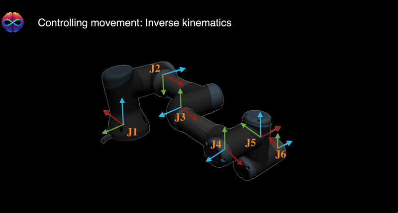

# InfinityWorld-UR3e-BCI-VR-Control

This repository contains a **BCI/IMU → Unity VR** testbed (**InfinityWorld**) where a user can control a **UR3e** robotic arm end-effector
(gripper orientation + simple directional motion) inside a Unity VR environment (“InfinityWorld”) using:

- **Head motion** (accelerometer from a BrainAccess headset) for continuous gripper rotation / head orientation.
- **EEG decoding (offline-trained)** for **3-class** commands (**Left / Right / None**) reported at ~**65%** accuracy (offline).
  A reference inference server is included; you can plug your trained weights and add the final “EEG → Unity command” mapping.

> ⚠️ This repo focuses on the **Unity simulation + communication + IK**.  
> If you later want to drive a *real* UR3e, add a robot-side interface (URScript/RTDE) that consumes the same joint targets.

---

## Demos

### 1) Head orientation estimation → wrist/gripper rotation


### 2) InfinityWorld VR environment presentation


### 3) IK angle computation concept (θ0..θ5)


Overall Pipeline :


---

## Contents

- [System overview](#system-overview)
- [Demos](#demos)
  - [Head orientation estimation → wrist/gripper rotation](#1-head-orientation-estimation--wristgripper-rotation)
  - [InfinityWorld VR environment presentation](#2-infinityworld-vr-environment-presentation)
  - [IK angle computation concept (θ0..θ5)](#3-ik-angle-computation-concept-θ0θ5)
- [Unity ↔ Python TCP API](#unity--python-tcp-api)
  - [Connection details](#connection-details)
  - [Message format](#message-format)
  - [Supported commands](#supported-commands)
  - [How the API is used in this project](#how-the-api-is-used-in-this-project)
    - [Mode A — Head orientation control (online)](#mode-a--head-orientation-control-online-)
    - [Mode B — EEG intent control (offline → online WIP)](#mode-b--eeg-intent-control-offline--online-wip)
  - [Timing, smoothing, and reliability notes](#timing-smoothing-and-reliability-notes)
    - [Important note about TCP](#important-note-about-tcp)
- [Inverse kinematics (math + implementation)](#inverse-kinematics-math--implementation)
  - [Robot geometry](#robot-geometry)
  - [Step 1 — base angle θ0](#step-1--base-angle-θ0)
  - [Step 2 — elbow angle θ2 (cosine rule)](#step-2--elbow-angle-θ2-cosine-rule)
  - [Step 3 — shoulder angle θ1](#step-3--shoulder-angle-θ1)
  - [Step 4 — wrist angles θ3–θ5 (end-effector orientation)](#step-4--wrist-angles-θ3θ5-end-effector-orientation)
    - [Tool direction vector a from (ry, rz)](#41-tool-direction-vector-a-from-ry-rz)
    - [Secondary direction vector b from (rx, ry, rz)](#42-secondary-direction-vector-b-from-rx-ry-rz)
    - [Express a and b in the arm frame (after joints 0–2)](#43-express-a-and-b-in-the-arm-frame-after-joints-02)
    - [Solve wrist angles θ3, θ4, θ5](#44-solve-wrist-angles-θ3-θ4-θ5)
  - [Applying angles to Unity joints](#applying-angles-to-unity-joints)
  - [Unit consistency](#unit-consistency)
- [Python signal pipeline](#python-signal-pipeline)
  - [Accelerometer → angles](#accelerometer--angles)
  - [EEG decoding (dataset → live headset inference)](#eeg-decoding-dataset--live-headset-inference)
- [Run the project](#run-the-project)
  - [Unity](#unity)
  - [Python (head orientation control)](#python-head-orientation-control)
  - [Python (EEG inference)](#python-eeg-inference)
- [Limitations](#limitations)
---

## System overview

**BrainAccess headset → Python → Unity → UR3e (VR)**

1. **BrainAccess headset** streams:
   - **Accelerometer** (online): used to estimate head orientation and drive wrist/gripper rotation.
   - **EEG** (decoded offline in current experiments): **3 classes** `Left / Right / None` with **~65% offline accuracy**.

2. **Python** acts as the *controller*:
   - Reads accelerometer samples and converts them to angles (roll/pitch/yaw).
   - Sends text commands over TCP (e.g., `rx 70`) to Unity.
   - Optionally loads a trained EEG decoder and outputs predicted class to be mapped to motion commands.

3. **Unity** acts as the *real-time robot controller*:
   - Receives commands through a minimal TCP “API”.
   - Updates a target pose `(px, py, pz, rx, ry, rz)`.
   - Runs IK each frame and writes joint angles to the UR3e joint transforms.

BrainAccess headset reference:
```txt
https://www.brainaccess.ai/products/brainaccess-standard-kit/
```
# Unity ↔ Python TCP API

Unity runs a TCP server (C#) and Python connects as a TCP client.

## Connection details

- **Host:** `localhost`
- **Port:** `12345`
- **Transport:** TCP
- **Encoding:** ASCII text
- **Framing:** one command per send (short messages)

In Unity, the server is created with:

```csharp
tcpListener = new TcpListener(IPAddress.Any, 12345);
tcpListener.Start();
tcpListener.BeginAcceptTcpClient(new AsyncCallback(OnClientConnect), null);
```

Python connects as:

```python
SERVER_ADDRESS = ("localhost", 12345)
client_socket = socket.socket(socket.AF_INET, socket.SOCK_STREAM)
client_socket.connect(SERVER_ADDRESS)
```

## Message format

There are two message formats:

### 1) Discrete move commands (single token)

- `left`
- `right`
- `up`
- `down`
- `forward`
- `backward`

### 2) Orientation commands (two tokens)

- `rx 70`
- `ry -10`
- `rz 90`

Notes:

- `rx`, `ry`, `rz` are angles in degrees
- Unity parses the numeric value as a `float`

## Supported commands

### Position updates (target translation)

In Unity, receiving a move command increments the target position by `positionStep`:

- left / right → `px -= positionStep` / `px += positionStep`
- up / down → `py += positionStep` / `py -= positionStep`
- forward / backward → `pz += positionStep` / `pz -= positionStep`

### Orientation updates (target rotation)

In Unity, receiving:

- `rx <deg>` sets `rx`
- `ry <deg>` sets `ry`
- `rz <deg>` sets `rz`

These values are used during IK to compute tool direction/orientation.

## How the API is used in this project

This project uses the same TCP API for two different control modes.

### Mode A — Head orientation control (online ✅)

Python reads the BrainAccess accelerometer and converts `(acc_x, acc_y, acc_z)` to angles, then streams updates like:

- `rx 65`
- `rx 66`
- `rx 66`
- `...`

Unity updates the end-effector orientation target and runs IK each frame. This drives the wrist/gripper rotation for grasp alignment and the “drinking from a cup” motion.

### Mode B — EEG intent control (offline → online WIP)

A trained EEG model produces a predicted class:

- `Left`
- `Right`
- `None`

A thin “bridge” can map predictions to the existing API:

- `Left` → `left`
- `Right` → `right`
- `None` → *(no command)*

Unity remains unchanged: it only consumes TCP commands.

## Timing, smoothing, and reliability notes

- The Python sender can stream at ~10–100 Hz depending on the sleep delay.
- Unity applies the latest received values each frame in `Update()`.

### Important note about TCP

TCP is a byte stream. The current Unity implementation assumes one full command per `Read()`. This typically works for short messages, but a more robust protocol uses newline framing:

- Python sends `rx 70\n`
- Unity reads a buffer and splits on `\n`

If you want to harden this project, newline framing is the first improvement to implement.

---

# Inverse kinematics (math + implementation)

This section matches what the Unity script computes in `CalculateIK()`.

## Robot geometry

We approximate the UR3e chain with link lengths (meters):

- `L1 = 0.1519` (base → shoulder height)
- `L2 = 0.24365` (shoulder → elbow)
- `L3 = 0.21325` (elbow → wrist 1)
- `L4, L5, L6 = 0` in this simulation version

Target pose:

- **Position:** `(px, py, pz)`
- **Orientation (degrees):** `(rx, ry, rz)`

## Step 1 — base angle θ0

Rotate the base to face the target in the XY plane:

- `θ0 = atan2(py, px)`

Unity:

```csharp
theta[0] = Mathf.Atan2(p5y, p5x);
```

## Step 2 — elbow angle θ2 (cosine rule)

Define:

- `A = sqrt(px^2 + py^2)`
- `B = pz - L1`
- `r^2 = A^2 + B^2`

Cosine rule term:

- `C3 = (r^2 - L2^2 - L3^2) / (2 * L2 * L3)`

Clamp to valid range:

- `C3 = clip(C3, -1, 1)`

Elbow angle:

- `θ2 = atan2( sqrt(1 - C3^2), C3 )`

Unity:

```csharp
C3 = (...) / (2 * L2 * L3);
C3 = Mathf.Clamp(C3, -1, 1);
theta[2] = Mathf.Atan2(Mathf.Sqrt(1 - C3*C3), C3);
```

Using `+sqrt(...)` corresponds to one branch (often “elbow-up”). The other branch uses `-sqrt(...)`.

## Step 3 — shoulder angle θ1

Let:

- `M = L2 + L3 * C3`

Then:

- `θ1 = atan2( M*A - L3*sin(θ2)*B,  L3*sin(θ2)*A + M*B )`

Unity:

```csharp
float M = L2 + L3 * C3;
float A = Mathf.Sqrt(p5x*p5x + p5y*p5y);
float B = p5z - L1;

theta[1] = Mathf.Atan2(
    M*A - L3*Mathf.Sin((float)theta[2])*B,
    L3*Mathf.Sin((float)theta[2])*A + M*B
);
```

## Step 4 — wrist angles θ3–θ5 (end-effector orientation)

After solving the arm angles `θ0..θ2`, the wrist angles orient the end-effector.

### 4.1 Tool direction vector a from (ry, rz)

Unity builds a direction vector `a = (ax, ay, az)`:

```csharp
float ax = Mathf.Cos(rz * Mathf.Deg2Rad) * Mathf.Cos(ry * Mathf.Deg2Rad);
float ay = Mathf.Sin(rz * Mathf.Deg2Rad) * Mathf.Cos(ry * Mathf.Deg2Rad);
float az = -Mathf.Sin(ry * Mathf.Deg2Rad);
```

This acts like a “forward” axis of the tool.

### 4.2 Secondary direction vector b from (rx, ry, rz)

Unity also computes `b = (bx, by, bz)`:

```csharp
float bx = Mathf.Cos(rx * Mathf.Deg2Rad) * Mathf.Sin(ry * Mathf.Deg2Rad) * Mathf.Cos(rz * Mathf.Deg2Rad)
         - Mathf.Sin(rx * Mathf.Deg2Rad) * Mathf.Sin(rz * Mathf.Deg2Rad);

float by = Mathf.Cos(rx * Mathf.Deg2Rad) * Mathf.Sin(ry * Mathf.Deg2Rad) * Mathf.Sin(rz * Mathf.Deg2Rad)
         + Mathf.Sin(rx * Mathf.Deg2Rad) * Mathf.Cos(rz * Mathf.Deg2Rad);

float bz = Mathf.Cos(rx * Mathf.Deg2Rad) * Mathf.Cos(ry * Mathf.Deg2Rad);
```

This provides an additional constraint to resolve rotation about `a`.

### 4.3 Express a and b in the arm frame (after joints 0–2)

Compute:

- `C1 = cos(θ0)`, `S1 = sin(θ0)`
- `C23 = cos(θ1 + θ2)`, `S23 = sin(θ1 + θ2)`

Then:

```csharp
float asx = C23 * (C1 * ax + S1 * ay) - S23 * az;
float asy = -S1 * ax + C1 * ay;
float asz = S23 * (C1 * ax + S1 * ay) + C23 * az;

float bsx = C23 * (C1 * bx + S1 * by) - S23 * bz;
float bsy = -S1 * bx + C1 * by;
float bsz = S23 * (C1 * bx + S1 * by) + C23 * bz;
```

### 4.4 Solve wrist angles θ3, θ4, θ5

```csharp
theta[3] = Mathf.Atan2(asy, asx);

theta[4] = Mathf.Atan2(
    Mathf.Cos((float)theta[3]) * asx + Mathf.Sin((float)theta[3]) * asy,
    asz
);

theta[5] = Mathf.Atan2(
    Mathf.Cos((float)theta[3]) * bsy - Mathf.Sin((float)theta[3]) * bsx,
    -bsz / Mathf.Sin((float)theta[4])
);
```

**Singularity note:** `θ5` divides by `sin(θ4)`. If `θ4 ≈ 0`, the wrist approaches a singularity and you may need guarding logic or smoothing.


## Applying angles to Unity joints

The script applies radians → degrees and writes to each joint’s `localEulerAngles`. The axis mapping depends on the UR3e model rig:

- `Joints[0]` rotates around **Y** by `θ0`
- `Joints[1]` rotates around **Z** by `θ1`
- `Joints[2]` rotates around **X** by `θ2`
- `Joints[3]` rotates around **Y** by `θ3`
- `Joints[4]` rotates around **Z** by `θ4`
- `Joints[5]` rotates around **Y** by `θ5`

## Unit consistency

UR3e link lengths above are in meters. Unity world units can be arbitrary. For correct IK behavior:

- ensure `(px, py, pz)` are expressed in the same unit system as `L1, L2, L3`, **or**
- scale the target position or link lengths consistently.

---

# Python signal pipeline

## Accelerometer → angles

From accelerometer `(acc_x, acc_y, acc_z)`:

- Roll: `roll = atan2(ay, az)`
- Pitch: `pitch = atan2(-ax, sqrt(ay^2 + az^2))`
- Yaw (simple proxy): `yaw = atan2(ay, ax)`

Converted to degrees, optionally offset for calibration (your current code uses `pitch_deg + 90`). The latest value is streamed to Unity as:

- `rx <pitch_deg>`
### EEG decoding (dataset → live headset inference)

For training, we used the **GigaDB EEG Dataset**. After training the model offline, we attempted **direct inference** by running the trained network on the **live EEG stream** coming from the BrainAccess headset.

Because the training dataset and the live headset data come from different acquisition setups (hardware, montage/electrode placement, sampling characteristics, noise profile, subject variability), offline performance may **not** transfer directly to the live stream without additional steps such as:

- channel mapping / montage alignment  
- consistent bandpass + notch filtering  
- per-subject calibration and normalization  
- domain adaptation / fine-tuning on BrainAccess-recorded data  

We **started experimenting with fine-tuning** to reduce this domain gap, but we **did not have enough time** to complete and validate the fine-tuned model within the project timeline.

In our current setup, the decoder targets **3 classes**: `Left / Right / None` (reported ~65% offline accuracy on the dataset), and we use the same Unity TCP command API to consume either:
- continuous **head-orientation** commands (`rx/ry/rz`), or
- discrete **EEG intent** commands (mapped from predicted class to `left/right/none`).
Pipeline:

1. Bandpass filter (example: 8–12 Hz)
2. Window to fixed length (248 samples)
3. Standardize
4. Model forward pass → argmax class

The predicted class can be mapped to Unity commands (`left` / `right` / `none`) using the same TCP API.

---

# Run the project

## Unity

1. Open the Unity project (e.g., `unity/`) in Unity.
2. Attach `InverseKinematicsKeyboardControl.cs` to a controller GameObject.
3. Assign UR3e joints to `Joints[]` in order (base → wrist3).
4. Press Play (Unity starts TCP server on port 12345).

## Python (head orientation control)

```bash
python python/stream_accel_to_unity.py
```

## Python (EEG inference)

```bash
python python/eeg_inference_server.py
```

---

# Limitations

- EEG results are offline; online decoding may differ.
- The TCP protocol is minimal (no newline framing, retries, or packet reconstruction).
- IK is designed for a real-time VR demo; robustness improvements may include:
  - joint limits
  - smoothing / filtering
  - singularity handling
  - collision constraints

