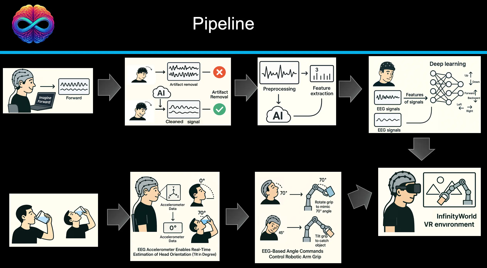

# InfinityWorld-UR3e-BCI-VR-Control

This repository contains a **BCI/IMU → Unity VR** testbed (**InfinityWorld**) where a user can control a **UR3e** robotic arm end-effector
(gripper orientation + simple directional motion) inside a Unity VR environment (“InfinityWorld”) using:

- **Head motion** (accelerometer from a BrainAccess headset) for continuous gripper rotation / head orientation.
- **EEG decoding (offline-trained)** for **3-class** commands (**Left / Right / None**) reported at ~**65%** accuracy (offline).
  A reference inference server is included; you can plug your trained weights and add the final “EEG → Unity command” mapping.

> ⚠️ This repo focuses on the **Unity simulation + communication + IK**.  
> If you later want to drive a *real* UR3e, add a robot-side interface (URScript/RTDE) that consumes the same joint targets.

---

## Demos

### 1) Head orientation estimation → gripper/wrist rotation


### 2) InfinityWorld VR environment presentation


---
## Pipeline


---

## Project layout

- `unity/` — Unity-side scripts (C#): inverse kinematics + TCP command server  
- `python/` — BrainAccess streaming + TCP client; optional EEG inference + bridge  
- `docs/` — IK derivation, TCP protocol, setup notes  
- `media/` — images and demo assets (add your GIF here)

---

## Quick start (Unity simulation)

### 1) Unity
1. Open your Unity project (your existing “InfinityWorld” project).
2. Copy `unity/Assets/Scripts/InverseKinematicsKeyboardControl.cs` into your project.
3. Add the script to the UR3e robot root GameObject.
4. In the Inspector, assign the `Joints` array (6 joint transforms from base → wrist 3).
5. Press Play.

Unity starts a TCP server on **port 12345** and waits for text commands.

### 2) Python (head-motion / accelerometer control)
1. Create an environment and install dependencies:
   ```bash
   cd python
   pip install -r requirements.txt
   ```
2. Run the BrainAccess-to-Unity streamer:
   ```bash
   python stream_accel_to_unity.py --device-name "BA MINI 003" --host 127.0.0.1 --port 12345
   ```

---

## TCP command protocol (Unity server)

Unity accepts simple ASCII messages:

- Cartesian steps:
  - `left`, `right`, `up`, `down`, `forward`, `backward`
- Wrist / end-effector orientation (degrees):
  - `rx <deg>`
  - `ry <deg>`
  - `rz <deg>`

See: `docs/Protocol_TCP.md`

---

## Inverse kinematics (C#)

The Unity script implements a lightweight analytical IK for a UR3e-like 6-DOF chain:
- Solve shoulder/elbow (θ1–θ3) from target position using the cosine rule.
- Solve wrist angles (θ4–θ6) from desired tool direction/orientation vectors.

Details: `docs/IK_UR3E_Unity.md`

---

## EEG decoding (optional)

- `python/eeg_inference_server.py` loads `theta.pth` + `lambda.pth` and prints the predicted class.
- `python/eeg_to_unity_bridge.py` shows the missing piece: **map predicted class → Unity command**.

You will likely want to:
- load the same scaler used during training (instead of `fit_transform` at inference)
- ensure input channel count and ordering match your headset montage

---

## Hardware

- Robot: **UR3e** (simulated in Unity)
- Headset: **BrainAccess Standard Kit** (EEG + accelerometer)

---

## License
MIT (see `LICENSE`)
